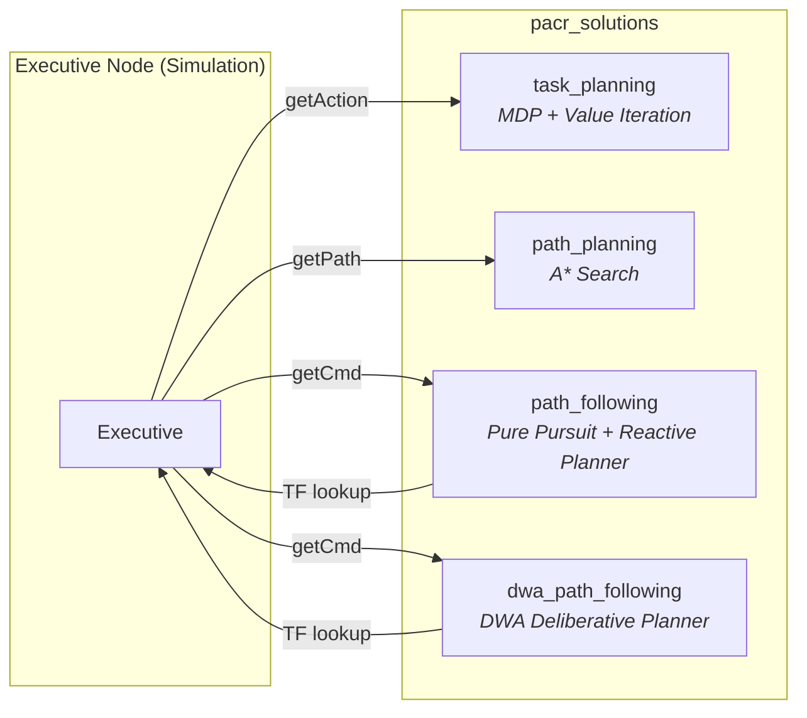

# PACR Solutions — Project Documentation

Welcome to the full documentation of the **pacr_solutions** ROS2 package. This project implements a complete autonomous robotics pipeline, from high-level task planning down to low-level collision avoidance, developed across three lab sessions (TPs).

---

## Architecture Overview

The system is composed of **three ROS2 nodes** working together through a service-based architecture. For TP2 path following, **two local planner implementations** are available — a reactive behavior-based planner and a deliberative DWA planner — selectable at launch time:



Each node is responsible for one layer of the decision-making hierarchy:

| Layer | Node | Algorithm | TP |
|-------|------|-----------|-----|
| **Strategic** | `task_planning` | MDP + Value Iteration | TP3 |
| **Tactical** | `path_planning` | A* Grid Search | TP1 |
| **Operational (Reactive)** | `path_following` | Pure Pursuit + Behavior-Based Scenarios | TP2 |
| **Operational (Deliberative)** | `dwa_path_following` | DWA Velocity-Space Optimization | TP2 |

---

## Package Structure

```
pacr_solutions/
├── pacr_solutions/
│   ├── planner.py              # A* search algorithm
│   ├── path_planning.py        # ROS2 node wrapping A*
│   ├── controller.py           # Pure Pursuit controller
│   ├── local_planner.py        # Reactive local planner (behavior-based scenarios)
│   ├── path_following.py       # ROS2 node (Pure Pursuit + Reactive Planner)
│   ├── dwa_planner.py          # DWA algorithm (deliberative local planner)
│   ├── dwa_path_following.py   # ROS2 node wrapping DWA planner
│   ├── mdp.py                  # MDP model + Value Iteration solver
│   └── task_planning.py        # ROS2 node wrapping MDP
├── launch/
│   ├── test_path_planning.launch.xml    # TP1
│   ├── test_path_following.launch.xml   # TP2 (supports both planners)
│   └── test_task_planning.launch.xml    # TP3 (supports both planners)
└── setup.py
```

---

## Navigation

Use the sidebar to navigate to each TP's detailed documentation:

- [**TP1 — Path Planning**](tp1.md): A* algorithm design, search space representation, and ROS2 integration.
- [**TP2 — Deliberative Planner (DWA)**](tp2_deliberative.md): Dynamic Window Approach — velocity-space sampling, trajectory simulation, adaptive obstacle avoidance, and multi-objective optimization.
- [**TP2 — Reactive Planner (Behavior-Based)**](tp2_reactive.md): Pure Pursuit controller, scenario-based collision avoidance (Stop, Speed Up, Dodge, Wait), and geometric predicates.
- [**TP3 — Task Planning**](tp3.md): MDP formulation, Value Iteration solver, concurrent robot awareness (Extension), and full system integration.
- [**Running the System**](running.md): Quick-start guide for launching each TP with the correct planner configuration.

