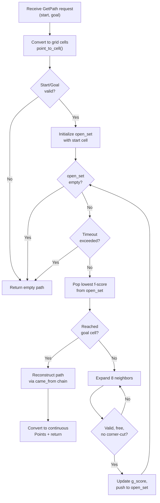

# TP1 — Path Planning

This section documents the design and implementation of the **global path planning** node, which uses the A* search algorithm on a 2D occupancy grid to compute optimal collision-free paths.

---

## Design Questions

### 1. What data source do we use to build the search space?

We use the **`costmap`** topic, which publishes an `OccupancyGrid` message. This message is produced by the simulation's map server and provides a 2D grid where each cell contains an integer value between 0 and 100, representing the probability of occupation. Our node subscribes to this topic using a **latching QoS** (`TRANSIENT_LOCAL`), meaning it receives the map immediately upon startup without needing to wait for a new publication cycle.

In our code, the callback stores it via `GridMap.from_msg(msg)`:

```python
latching_qos = QoSProfile(
    depth=1, durability=DurabilityPolicy.TRANSIENT_LOCAL)
self.costmap_sub = self.create_subscription(
    OccupancyGrid, 'costmap', self.costmap_cb,
    qos_profile=latching_qos)
```

### 2. What type of representation do we use?

We use a **discrete grid representation**. The continuous world coordinates (in meters) are converted to integer grid cell indices using the map's resolution and origin. Each cell is classified as either **free** (occupancy < 50) or **occupied** (occupancy ≥ 50). The search operates on an **8-connected graph**, where each cell has up to 8 neighbors (cardinal + diagonal directions).

The conversion functions in `planner.py` handle this:

```python
def point_to_cell(p: Point) -> Tuple[int, int]:
    float_indices = (p - grid_map.origin) / grid_map.resolution
    return tuple(map(round, float_indices))

def cell_to_point(c: Tuple[int, int]) -> Point:
    return grid_map.origin + Vector(c[0], c[1]) * grid_map.resolution
```

### 3. What topics and services does the node use?

| Direction | Name | Type | Purpose |
|-----------|------|------|---------|
| **Subscribe** | `costmap` | `OccupancyGrid` | Receive the environment map |
| **Service** | `get_path` | `GetPath` | Respond with planned paths |

The node does **not** publish to any topic. It is a pure service provider: the executive node calls `get_path` with a start and goal pose, and the node responds with a list of `Point2D` waypoints, which the executive node then handles publishing for visualization in RViz.    

### 4. What are the useful parameters?

| Parameter | Default | Description |
|-----------|---------|-------------|
| `timeout` | `5.0` s | Maximum time allocated for A* search before returning empty to maintain node responsiveness. |
| `Occupancy Threshold` | `50` | The value above which a grid cell is considered an obstacle (`is_free_cell`). |
| `Connectivity` | `8-way` | The neighbor expansion strategy (N, S, E, W + diagonals) used for path smoothing. |

The `timeout` parameter is essential for maintaining node responsiveness, if the planner cannot find a path within the allocated time, it gracefully returns an empty path rather than blocking the execution. The `Occupancy Threshold` ensures the robot only plans through cells it considers safe based on the costmap data. The `Connectivity` parameter controls the neighbor expansion strategy, which is set to 8-way connectivity (cardinal + diagonal directions) to allow diagonal movement.

### 5. Does the node need internal state?

Yes. The node maintains two internal fields:

- **`self.grid_map`**: The latest `GridMap` received from the costmap. This is initialized to `None` and populated by the `costmap_cb` callback. The `get_path_cb` service handler checks for `None` before attempting to plan, ensuring robustness.
- **`self.planner`**: An instance of the `Planner` class, which contains the A* algorithm logic. This is stateless between calls, each planning request is independent.

### 6. Do we create a separate planning module?

Yes, we deliberately chose to create a **separate `planner.py` module** containing the `Planner` class. This separation follows the **single-responsibility principle**:

- **`planner.py`** handles the pure algorithmic logic of A* search , coordinate conversion, heuristic computation, neighbor expansion, and path reconstruction. It has no dependency on ROS2.
- **`path_planning.py`** handles ROS2 integration , parameter declaration, topic subscription, service creation, and message type conversions.

This design makes the planner **testable independently** of ROS2 and **reusable** in other contexts.

---

## Algorithm: A* Search

The A* algorithm is implemented in `planner.py` with the following characteristics:

- **Graph type**: 8-connected grid (cardinal + diagonal movement)
- **Heuristic**: Euclidean distance in world coordinates (`math.hypot * resolution`)
- **Admissibility**: The heuristic is admissible (never overestimates), guaranteeing optimal paths
- **Diagonal safety**: Corner-cutting on diagonals is explicitly prevented
- **Timeout protection**: A configurable timeout ensures the node remains responsive



---

## Launch Configuration

The TP1 launcher (`test_path_planning.launch.xml`) starts the simulation infrastructure and the path planning node. In this configuration, the node only computes and publishes paths for visualization , it does not control the robot.

```xml
<include file="$(find-pkg-share pacr_simulation)/launch/test_path_planning.launch.xml" />
<node pkg="pacr_solutions" exec="path_planning" name="path_planning" output="screen">
    <param name="timeout" value="5.0" />
</node>
```
