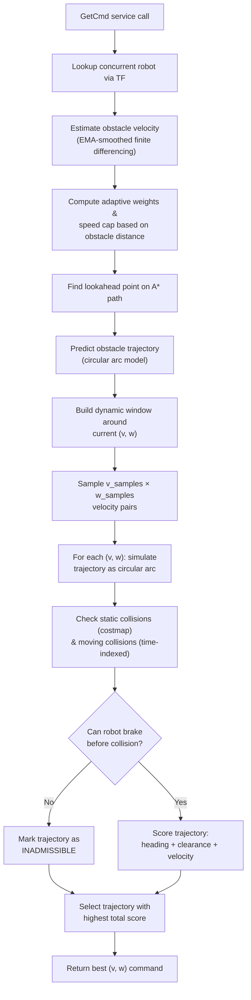
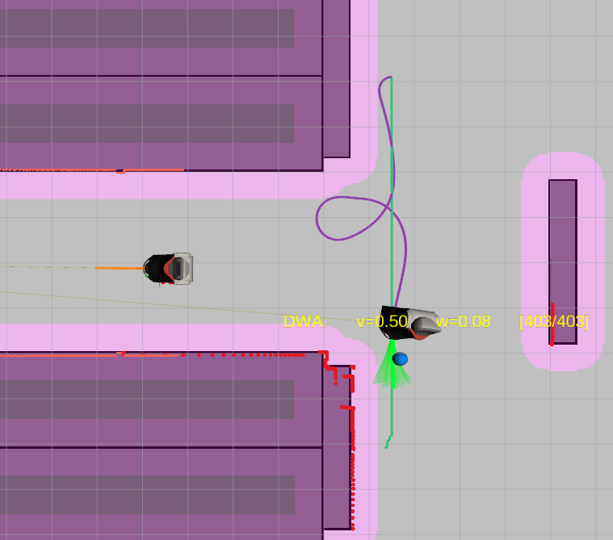

# TP2 — Deliberative Planner (DWA)

This section documents the design and implementation of the **DWA (Dynamic Window Approach) deliberative local planner**, an alternative to the reactive behavior-based planner. Instead of using hard-coded geometric scenarios, the DWA planner **samples the velocity space**, **simulates candidate trajectories**, and **selects the optimal command** by maximizing a weighted objective function — making it a truly **deliberative** approach.

---

## Design Questions

### 1. What topics, services, and publications does the node use?

| Direction | Name | Type | Purpose |
|-----------|------|------|---------|
| **Subscribe** | `costmap` | `OccupancyGrid` | Static occupancy map for collision checking |
| **Service** | `get_cmd` | `GetCmd` | Respond to the executive with velocity commands |
| **Publish** | `dwa_planner/markers` | `MarkerArray` | RViz visualization of DWA trajectories, lookahead point, and obstacle predictions |
| **TF Lookup** | `world` → `concurrent_robot/base_link` | TF2 | Track the concurrent robot's pose in real-time |

Like the reactive planner, the node does **not** subscribe to the path directly — the path is passed as part of the `GetCmd` service request by the executive node. The key difference is in what it **publishes**: instead of simple scenario labels, the DWA node visualizes all candidate trajectories, the selected best trajectory, the predicted obstacle path, and the lookahead point on the A* path.

### 2. What parameters are needed?

| Parameter | Default | Used By | Description |
|-----------|---------|---------|-------------|
| `v_max` | `0.5` | DWA Planner | Maximum linear velocity [m/s] |
| `w_max` | `1.0` | DWA Planner | Maximum angular velocity [rad/s] |
| `v_acc_max` | `0.5` | DWA | Maximum linear acceleration (defines dynamic window) |
| `w_acc_max` | `2.0` | DWA | Maximum angular acceleration (defines dynamic window) |
| `prediction_horizon` | `3.0` | DWA | How far ahead to simulate trajectories [s] |
| `dt` | `0.1` | DWA | Simulation time step [s] |
| `v_samples` | `13` | DWA | Number of linear velocity samples in the dynamic window |
| `w_samples` | `31` | DWA | Number of angular velocity samples in the dynamic window |
| `heading_weight` | `0.45` | DWA | Weight for the heading alignment objective |
| `clearance_weight` | `0.35` | DWA | Weight for the obstacle clearance objective |
| `velocity_weight` | `0.20` | DWA | Weight for the velocity maximization objective |
| `goal_tolerance` | `0.15` | DWA | Distance to goal at which the robot is considered arrived [m] |
| `safety_margin` | `0.50` | DWA | Minimum clearance around obstacles [m] |
| `lookahead_distance` | `0.8` | DWA | Distance ahead on the A* path for the heading target [m] |
| `static_frame_id` | `world` | TF | Reference frame for transforms |
| `other_frame_id` | `concurrent_robot/base_link` | TF | Frame of the concurrent robot to avoid |

Compared to the reactive planner (which has only 7 parameters), the DWA planner has **16 parameters** because it requires fine-grained control over the velocity sampling, trajectory simulation, and multi-objective optimization.

### 3. Do we create a separate controller class?

Yes. We create **two** separate classes, each in its own module:

- **`dwa_planner.py` → `DWAPlanner`**: Implements the full DWA algorithm — dynamic window computation, trajectory simulation, static and moving obstacle collision detection, and multi-objective scoring. This class is **stateless** between calls: each invocation receives the full world state and produces a command. This makes it testable in isolation without any ROS2 dependency.

- **`dwa_path_following.py` → `DWAPathFollowingNode`**: The ROS2 node that handles all I/O orchestration — parameter declaration, TF lookups, obstacle velocity estimation, costmap subscription, service handling, and RViz visualization. It delegates all planning logic to the `DWAPlanner` instance.

Additionally, we use a **`VelocitySmoother`** helper class (in `dwa_planner.py`) that applies an Exponential Moving Average (EMA) filter to smooth the estimated velocity of the concurrent robot, reducing noise from TF-based position differencing.

This separation follows the same design principle as the reactive approach: the **algorithm** is decoupled from the **ROS2 infrastructure**, enabling independent testing and reuse.

### 4. What internal fields does the node need?

| Field | Type | Purpose |
|-------|------|---------|
| `self.dwa` | `DWAPlanner` | DWA algorithm instance |
| `self.tf_buffer` | `Buffer` | TF2 buffer for transform lookups |
| `self.tf_listener` | `TransformListener` | TF2 listener populating the buffer |
| `self.grid_map` | `GridMap` or `None` | Latest costmap for static obstacle checking |
| `self.marker_pub` | `Publisher` | RViz marker publisher for DWA trajectories |
| `self.v_max` / `self.w_max` | `float` | Velocity limits for output clamping |
| `self._prev_other_pose` | `Pose` or `None` | Previous concurrent robot pose (for velocity estimation) |
| `self._prev_other_time` | `Time` or `None` | Timestamp of previous pose |
| `self._obstacle_vel_smoother` | `VelocitySmoother` | EMA filter for concurrent robot velocity |
| `self._cached_other_v` / `_w` / `_theta` | `float` | Cached obstacle velocity for visualization |
| `self.static_frame_id` | `str` | World reference frame |
| `self.other_frame_id` | `str` | Concurrent robot's TF frame |

The key difference from the reactive planner is the **velocity estimation infrastructure**: the DWA node tracks the concurrent robot's velocity over time (not just its position), because the DWA algorithm needs to **predict the obstacle's future trajectory** as circular arcs to perform time-indexed collision checking.

---

## The DWA Algorithm

The Dynamic Window Approach is a **deliberative** local planning method. Unlike the reactive planner that matches geometric scenarios, DWA **explores the full velocity space** accessible to the robot and selects the command that maximizes a multi-criteria objective function.

### Core Pipeline



### Step 1 — Dynamic Window Construction

The dynamic window constrains the search to velocities the robot can **physically reach** within one control step, given its current velocity and acceleration limits:

$$
V_s = \{ (v, \omega) \mid v \in [v_{curr} - \dot{v}_{max} \cdot \Delta t, \ v_{curr} + \dot{v}_{max} \cdot \Delta t], \quad \omega \in [\omega_{curr} - \dot{\omega}_{max} \cdot \Delta t, \ \omega_{curr} + \dot{\omega}_{max} \cdot \Delta t] \}
$$

The window is further clipped to the global velocity limits $[0, v_{max}]$ and $[-\omega_{max}, \omega_{max}]$. When the obstacle is nearby, the maximum velocity is adaptively capped (see §Adaptive Behavior below).

### Step 2 — Trajectory Simulation

For each sampled velocity pair $(v, \omega)$, we simulate a trajectory as a **circular arc** over the prediction horizon:

- If $|\omega| < \epsilon$ (straight line): $x \mathrel{+}= v \cos\theta \cdot dt$, $y \mathrel{+}= v \sin\theta \cdot dt$
- Otherwise (circular arc): $x \mathrel{+}= \frac{v}{\omega}(\sin(\theta + \omega \cdot dt) - \sin\theta)$, $y \mathrel{-}= \frac{v}{\omega}(\cos(\theta + \omega \cdot dt) - \cos\theta)$

Each trajectory produces `n_steps = prediction_horizon / dt` points.

### Step 3 — Collision Detection

Each trajectory is checked for two types of collisions:

**Static obstacles**: Each trajectory point is checked against the costmap. If a cell has occupancy ≥ 50, a collision is detected at that time step.

**Moving obstacle (time-indexed)**: We predict the concurrent robot's trajectory using the same circular arc model. Then, for each time step $t$, we compare the robot's predicted position with the obstacle's predicted position **at the same time** $t$. The collision radius **expands with time** to account for prediction uncertainty:

$$
r_{check}(t) = (r_{robot} + r_{safety}) \times (1 + 0.2 \cdot t)
$$

We also perform **midpoint checks** between consecutive time steps to catch fast-moving obstacles that might skip over trajectory points.

### Step 4 — Admissibility Check

A trajectory is **admissible** only if the robot can brake to a stop before the predicted collision:

$$
\text{admissible} \iff t_{collision} > 1.5 \times \frac{|v|}{a_{max}}
$$

The 1.5× safety factor ensures a conservative margin beyond the theoretical braking distance.

### Step 5 — Multi-Objective Scoring

Each admissible trajectory is scored using three weighted objectives:

$$
\text{score}(v, \omega) = w_h \cdot \text{heading}(v, \omega) + w_c \cdot \text{clearance}(v, \omega) + w_v \cdot \text{velocity}(v, \omega)
$$

| Objective | What It Measures | Score Range |
|-----------|-----------------|-------------|
| **Heading** | How well the trajectory aligns with (and progresses toward) the A* lookahead point | [0, 1] |
| **Clearance** | Time-to-collision and proximity to obstacles — penalizes trajectories passing near the obstacle | [0, 1] |
| **Velocity** | Linear velocity as a fraction of $v_{max}$ — favors faster progress | [0, 1] |

The **heading objective** is composed of two sub-scores: **direction alignment** (70%) — does the trajectory point toward the lookahead? — and **distance progress** (30%) — does the endpoint get closer to the lookahead?

The **clearance objective** combines **time-based clearance** (time until collision relative to braking time) and a **proximity penalty** (minimum distance to the obstacle). When the obstacle is nearby, the proximity penalty is weighted more heavily (60% vs 30%).

---

## Adaptive Behavior

A key feature of our DWA implementation is its **adaptive behavior** when the concurrent robot is nearby. This is what makes the planner truly context-aware, not just following a fixed policy.

### Adaptive Weights

The objective weights shift dynamically based on obstacle distance:

| Distance | Heading $w_h$ | Clearance $w_c$ | Velocity $w_v$ | Behavior |
|----------|---------------|-----------------|-----------------|----------|
| ≥ 3.5 m (far) | 0.45 | 0.35 | 0.20 | Normal: prioritize path following |
| ≈ 2.3 m (transition) | ≈ 0.30 | ≈ 0.57 | ≈ 0.12 | Intermediate: shifting to caution |
| ≤ 1.2 m (critical) | ≈ 0.18 | ≈ 0.78 | ≈ 0.04 | Emergency: clearance dominates |

The interpolation is linear between `DANGER_DIST = 3.5 m` and `CRITICAL_DIST = 1.2 m`, and weights are re-normalized to sum to 1.0.

### Adaptive Speed Cap

When the obstacle enters the slowdown zone (< 1.0 m), the maximum velocity is linearly reduced down to **30% of $v_{max}$** at the critical distance. This gives the robot more time to react and shortens braking distances.

### Danger-Zone Slowdown Near Goal

When within 0.5 m of the goal, the velocity is further capped proportionally to the remaining distance (`v = min(v, dist × 0.8)`), ensuring smooth deceleration on arrival.

---

## Obstacle Velocity Estimation

To predict the concurrent robot's future trajectory, we need to estimate its velocity. We do this using **finite differencing** of consecutive TF poses, smoothed with an **Exponential Moving Average (EMA)** filter (α = 0.3):

1. Look up the concurrent robot's pose via TF: `world → concurrent_robot/base_link`.
2. Compute the displacement $(dx, dy, d\theta)$ from the previous pose.
3. Divide by $\Delta t$ to get raw $(v, \omega)$.
4. Determine the **sign** of $v$ using the dot product of the heading vector and displacement vector (to distinguish forward vs. backward motion).
5. Apply EMA smoothing: $v_{smooth} = \alpha \cdot v_{raw} + (1 - \alpha) \cdot v_{prev}$.

The EMA filter with α = 0.3 heavily smooths the signal (favoring 70% of the previous estimate), which eliminates jitter from TF sampling noise while still tracking velocity changes within a few control cycles.

---

## Comparison: Reactive vs. Deliberative

| Aspect | Reactive (Behavior-Based) | Deliberative (DWA) |
|--------|--------------------------|-------------------|
| **Decision method** | Pattern-match geometric scenarios | Sample and evaluate velocity space |
| **Collision avoidance** | 4 pre-defined behaviors (Stop, Speed Up, Dodge, Wait) | Continuous optimization over all reachable velocities |
| **Obstacle prediction** | Linear trajectory extrapolation via sliding window | Circular arc prediction with expanding uncertainty |
| **Adaptiveness** | Fixed scenario thresholds | Adaptive weights, speed cap, and safety margin |
| **Computational cost** | Low (geometric checks) | Higher (13×31 = 403 trajectory evaluations per cycle) |
| **Robustness** | Can fail on unseen scenarios | Handles arbitrary configurations — always picks the best option available |
| **Tuning complexity** | Simple (safety radius + boost factor) | Complex (16 parameters control behavior) |

The DWA planner is more robust and general-purpose because it does not rely on classifying the situation into a finite set of scenarios. Instead, it **evaluates every possible action** and picks the best one — which is the hallmark of a deliberative approach.

---

## Parameters Between Launchers

### TP2 Parameters (`test_path_following.launch.xml`)

```xml
<param name="v_max" value="0.5" />
<param name="w_max" value="1.2" />
<param name="prediction_horizon" value="4.0" />
<param name="dt" value="0.2" />
<param name="v_samples" value="13" />
<param name="w_samples" value="31" />
<param name="heading_weight" value="0.50" />
<param name="clearance_weight" value="0.50" />
<param name="velocity_weight" value="0.20" />
<param name="safety_margin" value="0.15" />
<param name="lookahead_distance" value="1.5" />
```

### TP3 Parameters (`test_task_planning.launch.xml`)

```xml
<param name="v_max" value="0.5" />
<param name="w_max" value="1.0" />
<param name="v_acc_max" value="0.5" />
<param name="w_acc_max" value="2.0" />
<param name="prediction_horizon" value="3.0" />
<param name="dt" value="0.1" />
<param name="v_samples" value="13" />
<param name="w_samples" value="31" />
<param name="heading_weight" value="0.45" />
<param name="clearance_weight" value="0.35" />
<param name="velocity_weight" value="0.20" />
<param name="safety_margin" value="0.50" />
<param name="lookahead_distance" value="0.8" />
```

### Why the Parameters Differ

The TP2 parameters were tuned **to test the algorithm and ensure basic safety** — specifically to verify that head-on collisions do not occur during the path following test scenario. We used a larger `prediction_horizon` (4.0 s vs. 3.0 s) and a bigger `lookahead_distance` (1.5 m vs. 0.8 m) to give the planner more foresight, a higher `w_max` (1.2 vs. 1.0) for more aggressive turning, a coarser `dt` (0.2 s vs. 0.1 s) for faster computation, and initially equal `heading_weight` and `clearance_weight` (0.50/0.50) to balance path following and avoidance. The `safety_margin` was reduced to 0.15 m since the TP2 is simpler we decide the path no need to generalise the parameters.

In contrast, the TP3 parameters were **refined for the full task planning mission**, where the robot must perform multiple pick-transform-place cycles and repeatedly navigate the map. Here, we adopted more conservative, finely-tuned parameters: a tighter `lookahead_distance` (0.8 m) for more responsive path tracking in narrow corridors, a larger `safety_margin` (0.50 m) to handle the increased frequency of encounters, a finer simulation step `dt` (0.1 s) for more accurate trajectory prediction, and default objective weights (0.45/0.35/0.20) that prioritize heading alignment for more efficient navigation across multiple goals.

---

## RViz Visualization

The DWA node publishes a `MarkerArray` with rich visual feedback for debugging and demonstration:

| Marker | Type | Description |
|--------|------|-------------|
| Candidate trajectories | `LINE_STRIP` | Sampled subset of DWA trajectories, color-coded by score (green = high, red/blue = low, dark red = inadmissible) |
| Best trajectory | `LINE_STRIP` (thick green) | The selected optimal trajectory |
| Obstacle prediction | `LINE_STRIP` (orange) | Predicted circular arc trajectory of the concurrent robot |
| Lookahead point | `SPHERE` (blue) | The current heading target on the A* path |
| Status text | `TEXT_VIEW_FACING` | Shows `DWA: v=X.XX w=X.XX [admissible/total]` or `GOAL REACHED` or `EMERGENCY STOP` |



---

## Launch Configuration

The TP2 launcher supports switching between the reactive and DWA planners via the `local_planner` argument:

```xml
<!-- DWA Deliberative Local Planner -->
<node pkg="pacr_solutions" exec="dwa_path_following" name="dwa_path_following" output="screen"
      if="$(eval '\'$(var local_planner)\' == \'dwa\'')" >
    <param name="v_max" value="0.5" />
    <param name="w_max" value="1.2" />
    <param name="prediction_horizon" value="4.0" />
    <param name="dt" value="0.2" />
    <param name="v_samples" value="13" />
    <param name="w_samples" value="31" />
    <param name="heading_weight" value="0.50" />
    <param name="clearance_weight" value="0.50" />
    <param name="velocity_weight" value="0.20" />
    <param name="safety_margin" value="0.15" />
    <param name="lookahead_distance" value="1.5" />
</node>
```

To run with the DWA planner:

```bash
ros2 launch pacr_solutions test_path_following.launch.xml local_planner:=dwa
```
