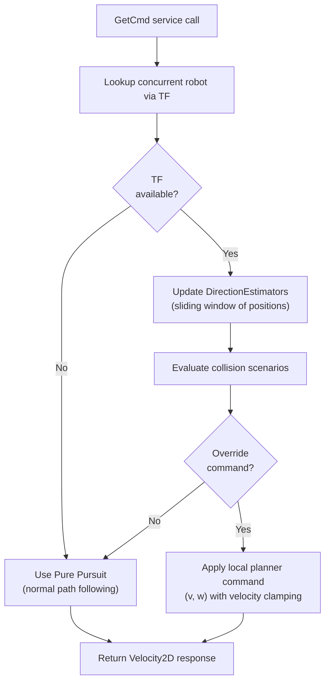
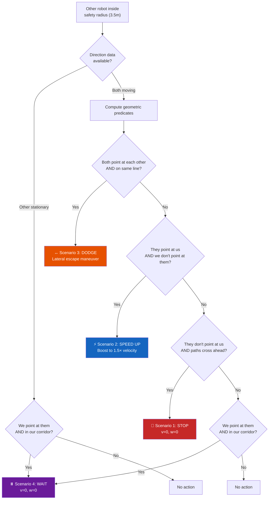
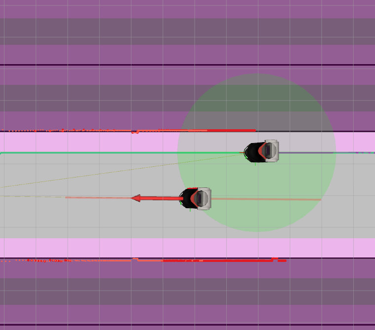

# TP2 — Reactive Planner (Behavior-Based)

This section documents the design and implementation of the **reactive behavior-based local planner**, which combines a Pure Pursuit controller for global trajectory tracking with a scenario-based reactive planner for dynamic collision avoidance. For the alternative deliberative approach using DWA, see the [TP2 — Deliberative Planner](tp2_deliberative.md) page.

---

## Design Questions

### 1. What topics, services, and publications does the node use?

| Direction | Name | Type | Purpose |
|-----------|------|------|---------|
| **Subscribe** | `costmap` | `OccupancyGrid` | Occupancy map for dodge maneuver validation |
| **Service** | `get_cmd` | `GetCmd` | Respond to executive with velocity commands |
| **Publish** | `local_planner/markers` | `MarkerArray` | RViz visualization of planner state |
| **TF Lookup** | `world` → `concurrent_robot/base_link` | TF2 | Track the concurrent robot's pose |

The node does **not** subscribe to the path directly. Instead, the path is passed as part of the `GetCmd` service request by the executive node.

### 2. What parameters are needed?

| Parameter | Default | Used By | Description |
|-----------|---------|---------|-------------|
| `v_max` | `0.5` | Pure Pursuit | Maximum linear velocity |
| `w_max` | `1.0` | Pure Pursuit | Maximum angular velocity |
| `lookahead_distance` | `0.4` | Pure Pursuit | Distance to lookahead point on path |
| `safety_radius` | `3.5` | Local Planner | Radius within which scenarios activate |
| `v_boost_factor` | `1.5` | Local Planner | Speed multiplier for Scenario 2 |
| `static_frame_id` | `world` | TF | Reference frame for transforms |
| `other_frame_id` | `concurrent_robot/base_link` | TF | Frame of the robot to avoid |

### 3. Do we create a separate controller class?

Yes. We create **two** separate classes, each in its own module:

- **`controller.py` → `PathFollower`**: Implements the Pure Pursuit algorithm. It computes `(v, w)` commands based on the robot's pose and a path. This class is **stateless** — it has no memory between calls — which makes it simple, predictable, and testable in isolation.

- **`local_planner.py` → `LocalPlanner`**: Implements the behavior-based collision avoidance logic. Unlike the controller, this class is **stateful** — it maintains direction estimator histories and an active dodge waypoint across calls. This state is essential for smooth, consistent avoidance maneuvers.

This separation was chosen because the controller and the planner have fundamentally different responsibilities. The controller answers *"how do I follow this path?"* while the planner answers *"should I even follow this path right now, or do something else?"*

### 4. What internal fields does the node need?

| Field | Type | Purpose |
|-------|------|---------|
| `self.controller` | `PathFollower` | Pure Pursuit controller instance |
| `self.local_planner` | `LocalPlanner` | Collision avoidance planner |
| `self.tf_buffer` | `Buffer` | TF2 buffer for transform lookups |
| `self.tf_listener` | `TransformListener` | TF2 listener populating the buffer |
| `self.grid_map` | `GridMap` or `None` | Latest costmap for spatial reasoning |
| `self.marker_pub` | `Publisher` | RViz marker publisher |
| `self.static_frame_id` | `str` | World reference frame |
| `self.other_frame_id` | `str` | Concurrent robot's TF frame |

The **dependency** from TP1 is the `costmap` subscription — the same occupancy grid used by the A* planner is also used here by the local planner to validate dodge waypoints against walls.

---

## Pure Pursuit Controller

The Pure Pursuit algorithm steers the robot toward a **lookahead point** on the planned A* path. It computes curvature-based steering commands that smoothly guide the robot along the trajectory.

The key control law is:

$$
\kappa = \frac{2 \sin(\alpha)}{L_d}
$$

where $\alpha$ is the angle between the robot's heading and the lookahead point, and $L_d$ is the distance to that point. The angular velocity is then $\omega = v \cdot \kappa$.

The controller also includes:

- **Goal alignment**: When close to the goal, it switches to pure rotation to match the target orientation.
- **Speed modulation**: Linear velocity is reduced when the robot faces away from the path (preventing wide turns) and near the goal (smooth deceleration).

---

## Behavior-Based Local Planner

The local planner is the core intelligence of TP2. It uses **TF-based tracking** of the concurrent robot to detect four distinct collision scenarios and override the Pure Pursuit controller when needed.

we implemented a Behavioral Local Planner that uses Geometric Scenarios to override the global path follower. It uses a Direction Estimator to perform Linear Trajectory Prediction for the concurrent agent, allowing for avoidance maneuvers like lateral dodging and velocity boosting.
### Architecture



### Scenario Decision Tree



### Geometric Predicates

The local planner relies on four key geometric functions:

| Function | Purpose | Key Parameters |
|:---|:---|:---|
| `_is_other_on_our_path_ahead()` | Checks if the other robot is physically blocking any future waypoint on our actual planned A* path. | Corridor width: 0.8m |
| `_other_trajectory_crosses_our_path()` | Projects the other robot's estimated trajectory and checks for intersections with our future path waypoints. | Corridor width: 0.8m |
| `is_pointing_at()` | (Used for the other robot) Checks if their estimated direction vector is aimed at our current position. | Angle threshold: 15° |
| `_get_path_direction()` | Computes our own robot's "Forward" vector based on the next lookahead point of the A* plan rather than past history. | Lookahead: 10.0m |


### Direction Estimator

The concurrent robot's direction is estimated using a **sliding window** of the last 5 positions. The direction vector is computed from the oldest to the newest stored position, providing a stable, noise-resilient heading estimate. This is significantly more reliable than using the instantaneous pose orientation, which can be noisy during turns.

and for our robot we use our predicted trajectory from the A* planner.
### Scenario Details

**Scenario 1 — STOP (Let them pass):** The other robot's trajectory crosses ours ahead, but it is not heading toward us. We stop and wait for it to clear our safety radius.

**Scenario 2 — SPEED UP (Run):** The other robot is heading toward us, but we are not heading toward it. We boost our velocity by 1.5× along the existing A* path to escape the threat.

**Scenario 3 — DODGE (Give way):** Head-on collision — both robots point at each other on the same trajectory line. We compute a lateral escape point perpendicular to our heading direction, preferring the side **away** from the other robot. The escape point is validated against the costmap to ensure it is not inside a wall.

**Scenario 4 — WAIT (Wait behind):** We are approaching the other robot (which is stationary or slow-moving), and it is physically blocking our future trajectory. Instead of using a simple direction vector, this scenario now performs a **path-based corridor check** using `_is_other_on_our_path_ahead()`. This ensures we only stop if the other agent is within a **0.8m corridor** of our actual A* planned waypoints, effectively ignoring robots that are passing in parallel lanes even if they are within our safety radius.

## RViz Visualization

The node publishes a `MarkerArray` with 6 marker types for real-time debugging:

| ID | Type | Description |
|----|------|-------------|
| 0 | Cylinder | Safety radius circle (green = safe, red = threat) |
| 1 | Arrow | Other robot's estimated direction (red) |
| 2 | Line Strip | Other robot's trajectory extension (translucent red) |
| 3 | Text | Active scenario label (e.g., "S3: DODGE") |
| 4 | Sphere | Dodge waypoint (orange, only during Scenario 3) |



---

## Launch Configuration

The TP2 launcher starts both the A* path planning node and the path following node:

```xml
<!-- Global Path Planning Node (A*) -->
<node pkg="pacr_solutions" exec="path_planning" name="path_planning" output="screen">
    <param name="timeout" value="5.0" />
</node>

<!-- Pure Pursuit Path Following Node -->
<node pkg="pacr_solutions" exec="path_following" name="path_following" output="screen">
    <param name="v_max" value="0.5" />
    <param name="w_max" value="1.0" />
    <param name="lookahead_distance" value="0.4" />
</node>
```
