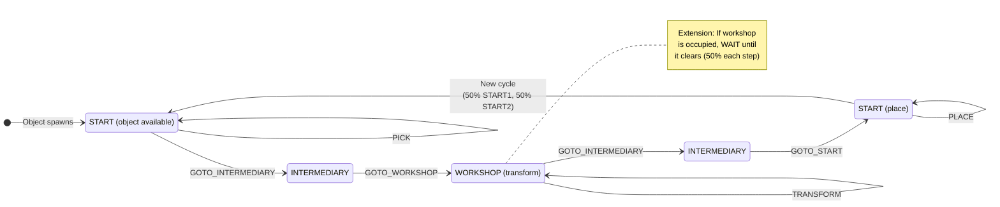
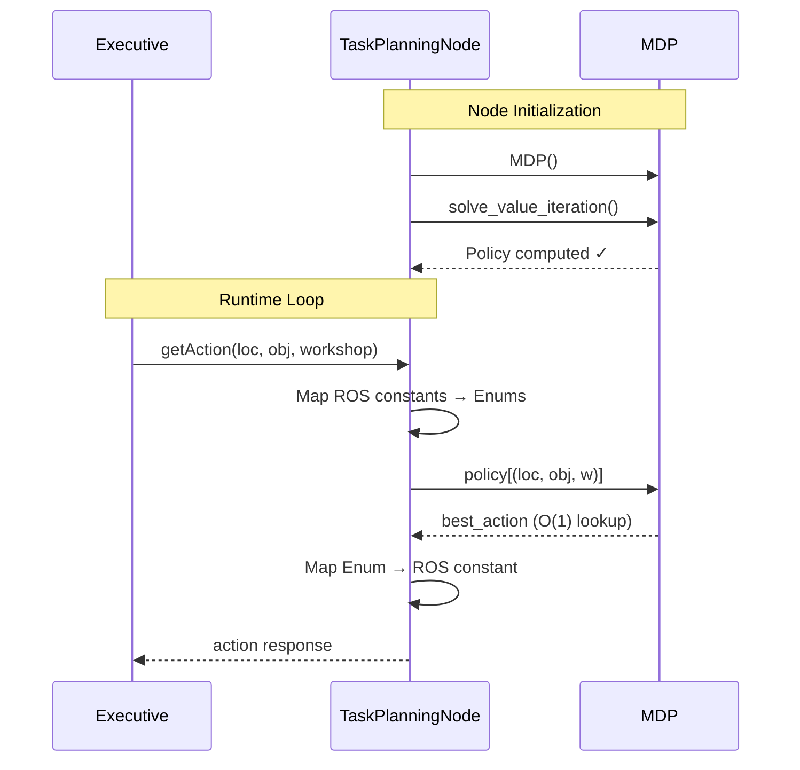
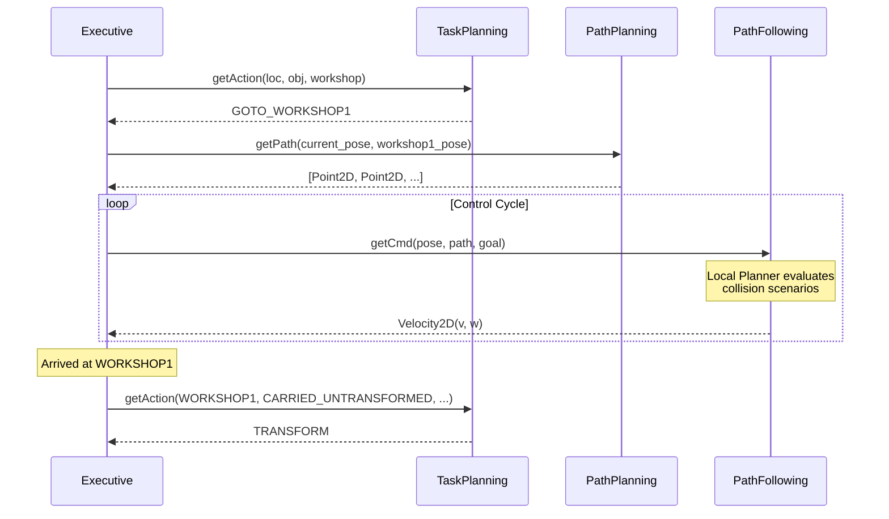

# TP3 — Task Planning

This section documents the design and implementation of the **high-level task planning** node, which uses a Markov Decision Process (MDP) with Value Iteration to compute the optimal strategy for the robot's mission. It also covers the **project extension** for concurrent robot awareness.

---

## Design Questions — Model

### 1. How do we represent the state of the system?

The system state is a **tuple of three components**: `(RobotLocation, ObjectState, WorkshopOccupancy)`.

```python
class RobotLocation(Enum):
    OTHER = 0
    START1 = 1;  START2 = 2
    WORKSHOP1 = 3;  WORKSHOP2 = 4
    INTERMEDIARY1 = 5;  INTERMEDIARY2 = 6;  INTERMEDIARY3 = 7

class ObjectState(Enum):
    NO_OBJECT = 0
    START1 = 1;  START2 = 2
    CARRIED_UNTRANSFORMED = 3
    CARRIED_TRANSFORMED = 4

class WorkshopOccupancy(Enum):   # ← Project Extension
    NONE = 0
    WORKSHOP1 = 1;  WORKSHOP2 = 2
```

| Component | Values | Meaning |
|-----------|--------|---------|
| `RobotLocation` | 7 (excluding OTHER) | Where the robot currently is |
| `ObjectState` | 5 | What the robot is carrying / where objects are |
| `WorkshopOccupancy` | 3 | Which workshop the concurrent robot occupies |

The total state space size is **7 × 5 × 3 = 105 states**. The `OTHER` location is excluded from the state space since the robot should never be there during normal operation.

### 2. What are the available actions?

```python
class Action(Enum):
    PICK = 0;  PLACE = 1;  TRANSFORM = 2;  WAIT = 3
    GOTO_OTHER = 4;  GOTO_START1 = 5;  GOTO_START2 = 6
    GOTO_WORKSHOP1 = 7;  GOTO_WORKSHOP2 = 8
    GOTO_INTERMEDIARY1 = 9;  GOTO_INTERMEDIARY2 = 10;  GOTO_INTERMEDIARY3 = 11
```

Actions are **state-dependent**. The `get_actions()` method enforces preconditions:

| Action | Precondition |
|--------|-------------|
| `PICK` | Robot is at the same location as an available object |
| `PLACE` | Robot carries a transformed object and is at START1 or START2 |
| `TRANSFORM` | Robot carries an untransformed object and is at a workshop |
| `GOTO_X` | X is reachable from current location AND not occupied (Extension) |
| `WAIT` | Always available |

### 3. What is the transition function?

The transition function determines the next state $s'$ and reward $R$ given a current state $s$ and action $a$. In our implementation (`mdp.py`), the environment is mostly **deterministic**, with two sources of **stochasticity**:

| Action | Transition Probabilities | Resulting State |
|--------|--------------------------|-----------------|
| `PICK` | 100% | Object state becomes `CARRIED_UNTRANSFORMED` |
| `TRANSFORM` | 100% | Object state becomes `CARRIED_TRANSFORMED` |
| `GOTO_*` | 100% | Robot location changes to the target waypoint |
| `PLACE` | **50%**<br>**50%** | Object placed; new object spawns at `START1`<br>Object placed; new object spawns at `START2` |
| `WAIT` | **50%**<br>**50%** | If a workshop is occupied: stays occupied<br>If a workshop is occupied: becomes `NONE` (clears) |

The stochasticity in `PLACE` models the uncertainty of where the next raw material will appear in the factory. The stochasticity in `WAIT` (introduced in the Extension) models the probability that the concurrent robot finishes its task and vacates a workshop while we wait. If the workshops are already empty, `WAIT` is 100% deterministic (workshops stay empty).

### 4. What is the reward function?

The reward function $R(s, a)$ is designed to penalize time spent and heavily reward task completion. It is defined as:

$$
R(s, a) = - \text{duration}(a) \ + \ \text{bonus}(a)
$$

Every action incurs a negative reward equal to its estimated duration in seconds. This ensures the Value Iteration algorithm searches for the **fastest** sequence of actions, not just any valid sequence.

A massive positive bonus is granted **only** when a transformed object is successfully placed at a start location, completing a full cycle:

| Action | Time Penalty (Cost) | Completion Bonus | Total Reward |
|--------|---------------------|------------------|--------------|
| `PICK` | -5.0 | 0.0 | **-5.0** |
| `PLACE` | -5.0 | +1000.0 | **+995.0** |
| `TRANSFORM` | -10.0 | 0.0 | **-10.0** |
| `WAIT` | -2.0 | 0.0 | **-2.0** |
| `GOTO_*` | -7.0 | 0.0 | **-7.0** |
| *(Invalid)* | -1.0 | 0.0 | **-1.0** |

By providing a +1000 reward for `PLACE`, the MDP is strongly incentivized to undergo the costs of picking (-5), navigating (-7 multiple times), and transforming (-10) to reach the payout.

### 5. How do we estimate missing durations?

The durations used in the reward function are empirical estimates based on the physics and constraints of the ROS2 simulation:

1. **Manipulation (`PICK`, `PLACE` = 5.0s):** The simulated robotic arm mechanism takes approximately 5 seconds to securely grasp or release an object.
2. **Processing (`TRANSFORM` = 10.0s):** The workshop machinery takes 10 seconds to process a raw object into a transformed one.
3. **Idling (`WAIT` = 2.0s):** A brief 2-second polling interval to re-evaluate the environment (e.g., checking if the concurrent robot has left the workshop) without wasting too much time.

### 6. How do we compute the optimal strategy?

We use **Value Iteration** with a discount factor \(\gamma = 0.99\). The algorithm iterates over all states, computing the Bellman optimality equation until convergence:

\[
V^*(s) = \max_a \sum_{s'} P(s' | s, a) \left[ R(s, a) + \gamma V^*(s') \right]
\]

```python
def solve_value_iteration(self, epsilon=1e-3, max_iterations=1000):
    for i in range(max_iterations):
        delta = 0
        new_V = self.V.copy()
        for s in self.states:
            best_val = -float('inf')
            for a in self.get_actions(s):
                transitions = self.transition(s, a)
                expected_val = sum(
                    prob * (reward + self.gamma * self.V[next_s])
                    for prob, next_s, reward in transitions
                )
                if expected_val > best_val:
                    best_val = expected_val
                    best_act = a
            new_V[s] = best_val
            self.policy[s] = best_act
            delta = max(delta, abs(new_V[s] - self.V[s]))
        self.V = new_V
        if delta < epsilon:
            break
```

The convergence criterion is ε = 0.001. The algorithm typically converges within fewer than 100 iterations for our 105-state space.

---

## MDP State Machine



---

## Design Questions — Implementation

### 7. What classes do we define or reuse?

| Class | Module | New/Reused | Purpose |
|-------|--------|------------|---------|
| `MDP` | `mdp.py` | **New** | State space, transitions, Value Iteration solver |
| `RobotLocation` | `mdp.py` | **New** | Enum for discrete locations |
| `ObjectState` | `mdp.py` | **New** | Enum for object handling state |
| `WorkshopOccupancy` | `mdp.py` | **New** | Enum for concurrent robot awareness (Extension) |
| `Action` | `mdp.py` | **New** | Enum for high-level actions |
| `TaskPlanningNode` | `task_planning.py` | **New** | ROS2 node wrapping the MDP |
| `PathPlanningNode` | `path_planning.py` | **Reused from TP1** | A* path planning |
| `DWAPathFollowingNode` | `dwa_path_following.py` | **Reused from TP2** | DWA deliberative local planner (default) |
| `DWAPlanner` | `dwa_planner.py` | **Reused from TP2** | DWA algorithm |
| `PathFollowingNode` | `path_following.py` | **Reused from TP2** | Reactive local planner (alternative) |
| `PathFollower` | `controller.py` | **Reused from TP2** | Pure Pursuit controller |
| `LocalPlanner` | `local_planner.py` | **Reused from TP2** | Reactive collision avoidance |
| `Planner` | `planner.py` | **Reused from TP1** | A* algorithm |

### 8. What services does the task planning node provide?

The node provides a single service:

| Service | Type | Purpose |
|---------|------|---------|
| `get_action` | `GetAction` | Returns the optimal action for a given world state |

The service request contains:

- `controlled_robot_location`: Current robot location
- `object_state`: Current object handling state
- `workshop_state`: Which workshop the concurrent robot occupies (Extension)

The service response contains a single `action` field with the MDP-computed optimal action.

### 9. When are the Python classes used in the ROS node?

| When | What happens |
|------|-------------|
| **Node creation** (`__init__`) | `MDP()` is instantiated and `solve_value_iteration()` is called. The entire policy is pre-computed **once** at startup. |
| **Service request** (`get_action_cb`) | The incoming ROS constants are mapped to MDP enums via lookup dictionaries. The pre-computed `policy[state]` is queried — this is an O(1) dictionary lookup, not a new computation. The result is mapped back to ROS constants. |

This design is highly efficient: the expensive Value Iteration runs **once** during initialization, and all subsequent requests are simple hash table lookups.



---

## Project Extension — Concurrent Robot Awareness

The extension integrates the concurrent robot's workshop occupancy into the MDP model. This is implemented through:

1. **State space expansion**: `WorkshopOccupancy` adds a third dimension to the state tuple (NONE, WORKSHOP1, WORKSHOP2).

2. **Action filtering**: `get_allowed_goto()` removes `GOTO_WORKSHOP1` or `GOTO_WORKSHOP2` from available actions when the corresponding workshop is occupied.

3. **Probabilistic transitions**: When the robot performs `WAIT` and a workshop is occupied, there is a 50% chance the concurrent robot leaves (transition to `WorkshopOccupancy.NONE`).

4. **ROS integration**: The `TaskPlanningNode` maps the `workshop_state` field from the `GetAction` request to the internal `WorkshopOccupancy` enum.

---

## Full System Integration

In TP3, all three nodes work together through the executive's service chain:



---
## remark 

We changed the DWA parameters in TP3 compared to TP2 based on the requirements of the full task planning mission. In TP2, the parameters were set up primarily to test the algorithm and ensure head-on collisions do not occur during a single traversal. In TP3, the parameters were refined for repeated multi-goal navigation: tighter lookahead (0.8 m), larger safety margin (0.50 m), and finer simulation step (0.1 s) to handle the increased frequency of encounters during pick-transform-place cycles. See the [TP2 Deliberative Planner](tp2_deliberative.md#parameters-between-launchers) page for a detailed parameter comparison.

## Launch Configuration

The TP3 launcher brings up the complete system. It defaults to the **DWA deliberative planner** but can be switched to the reactive planner via the `local_planner` argument:

```bash
# Default (DWA planner)
ros2 launch pacr_solutions test_task_planning.launch.xml

# Reactive planner
ros2 launch pacr_solutions test_task_planning.launch.xml local_planner:=reactive
```

```xml
<!-- MDP Task Planning Node -->
<node pkg="pacr_solutions" exec="task_planning" name="task_planning" output="screen" />

<!-- Global Path Planning Node (A*) -->
<node pkg="pacr_solutions" exec="path_planning" name="path_planning" output="screen">
    <param name="timeout" value="5.0"/>
</node>

<!-- DWA Deliberative Local Planner (default) -->
<node pkg="pacr_solutions" exec="dwa_path_following" name="dwa_path_following" output="screen">
    <param name="v_max" value="0.5"/>
    <param name="w_max" value="1.0"/>
    <param name="prediction_horizon" value="3.0"/>
    <param name="dt" value="0.1"/>
    <param name="heading_weight" value="0.45"/>
    <param name="clearance_weight" value="0.35"/>
    <param name="velocity_weight" value="0.20"/>
    <param name="safety_margin" value="0.50"/>
    <param name="lookahead_distance" value="0.8"/>
</node>
```

